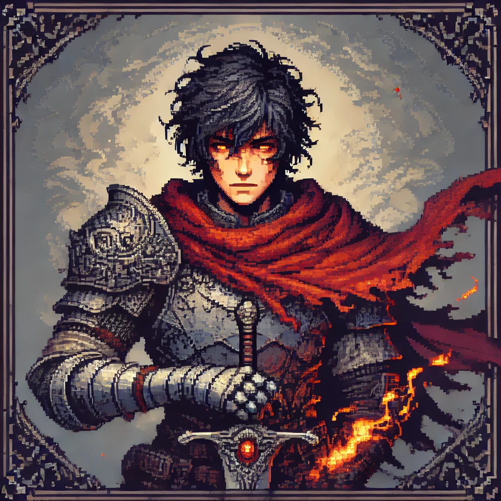

# El Caído de Vaelthar: Crónicas de la Traición



## Descripción
"El Caído de Vaelthar: Crónicas de la Traición" es un juego de acción y aventura desarrollado en Godot, basado en la historia de Vassarian, un guerrero traicionado y exiliado que busca redimir su honor y vengarse de quienes le arrebataron todo. Con combates desafiantes, una narrativa profunda y un sistema de habilidades basado en el colgante de Valea, el juego sumerge al jugador en un mundo de conspiraciones y redención.

## Características Principales
- **Historia inmersiva:** Un relato de traición, venganza y redención ambientado en el reino de Vaelthar.
- **Combate dinámico:** Sistema de lucha fluido con ataques, habilidades especiales y el frenesí de Vassarian.
- **Exploración y misiones:** Descubre los secretos de Vaelthar y forja alianzas para recuperar el honor perdido.
- **Habilidad especial del Fénix:** Usa el colgante de Valea para desatar poderes devastadores.

---

## Instalación y Ejecución
### Requisitos
- [Godot Engine](https://godotengine.org/) (versión 4.0 o superior)
- Sistema operativo: Windows, Linux o macOS
- Procesador y tarjeta gráfica compatibles con OpenGL 3.3 o superior

### Clonar el repositorio
```sh
 git clone https://github.com/gabrielcarvajalfigueroa/Vassarian.git
 cd vassarian
```

### Ejecutar el juego en Godot
1. Abre Godot.
2. Selecciona "Importar proyecto" y elige la carpeta del repositorio clonado.
3. Ejecuta el juego desde el botón "Ejecutar escena principal".

---

## Estructura del Proyecto
```sh
vassarian/
├── assets/                # Recursos visuales, sprites, texturas, animaciones
├── audio/                 # Música y efectos de sonido
├── scripts/               # Códigos en GDScript
│   ├── player.gd          # Control del personaje principal
│   ├── enemy.gd           # IA de los enemigos
│   ├── combat_system.gd   # Lógica del combate
│   ├── dialogue_system.gd # Sistema de diálogos
│   ├── game_manager.gd    # Control general del juego
├── scenes/                # Escenarios y niveles
│   ├── main.tscn          # Escena principal del juego
│   ├── menu.tscn          # Menú principal
│   ├── battle_arena.tscn  # Arena de combate
│   ├── city.tscn          # Ciudad de Luisius Mari
├── shaders/               # Sombras y efectos visuales
├── ui/                    # Interfaces de usuario (HUD, menús, inventario)
├── config/                # Configuraciones y datos del juego
├── README.md              # Documento de explicación del proyecto
├── LICENSE                # Licencia del proyecto
├── .gitignore             # Archivos y carpetas ignorados en Git
```

---

## Contribución
Si deseas contribuir, puedes:
- Reportar errores en la sección de "Issues" del repositorio.
- Proponer mejoras en la jugabilidad y la historia.
- Enviar Pull Requests con correcciones o nuevas funcionalidades.

### Contacto
Para consultas, puedes contactarme en [tu correo o enlace de contacto].

---

## Licencia
Este proyecto está bajo la licencia [nombre de la licencia]. Consulta el archivo `LICENSE` para más detalles.
